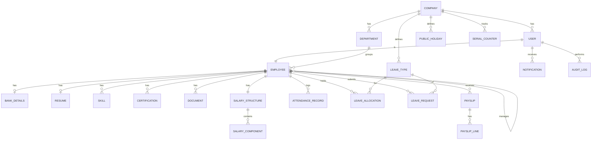

# Dayflow — HRMS Build Plan & Technical Spec
> *Every workday, perfectly aligned.*

**Audience:** the coding agent building this system.
**Source of truth:** the SRS (`Dayflow - Human Resource Management System`) + the 8 wireframe screens.
**Goal:** a from-scratch, database-first HRMS that scores on the hackathon's stated priorities — **database design (highest weight)**, modular architecture, real/dynamic data, robust validation, security, and clean UI.

---

## 0. How to use this document
Build in the phase order in §14. Do **not** skip the database layer (§4) or the business-logic contracts (§5) — they are the spine of the whole system and the single biggest scoring lever. Every ambiguity found in the source docs is resolved explicitly in §18 so you never have to guess.

---

## 1. Product vision & what makes it stand out
Dayflow is a role-based HR platform where the **attendance ledger is the source of truth for payroll**. Everything connects: an employee checks in → attendance record is created → at month end that ledger auto-computes payable days → the payslip is generated from the salary structure minus loss-of-pay. Nothing is a static form; every number is derived.

**What we add on top of the brief to stand out (all self-hosted, no third-party lock-in):**
1. **Real-time presence** — the green/grey/yellow status dots on employee cards update live via WebSockets the instant someone checks in/out or a leave is approved.
2. **Auto-generated payslips as downloadable PDFs**, computed from attendance + salary structure (no external API — rendered server-side).
3. **Configurable salary engine** — components are computed, not typed. Change the wage once and every component recalculates and always sums exactly to the wage.
4. **Analytics dashboard** — attendance %, leave utilisation, headcount by department, monthly payroll cost.
5. **Audit log** — every sensitive change (salary edit, approval, role change) is recorded with who/when/old→new. Directly demonstrates the "security" and "attention to detail" criteria.
6. **Attendance regularisation** — forgot to check out? Raise a correction request that HR approves.
7. **Notification centre + email** on approvals, rejections, and account creation.
8. **Public-holiday-aware leave** — holidays and weekends never count against leave balance or payable days.

These are deliberately built **from scratch with a local database and no BaaS**, which is exactly what the brief asked for. That restraint is itself a differentiator.

---

## 2. Recommended tech stack

| Layer | Choice | Why |
|---|---|---|
| **Database** | **PostgreSQL 15+** | Relational, transactional, great for the normalized model below. Same DB Odoo itself uses. |
| **Backend** | **Node.js + Express + Prisma ORM (TypeScript)** | Prisma's schema file is human-readable and *shows off* the data model; migrations are first-class; TypeScript enforces coding standards. |
| **Real-time** | **Socket.io** | Live presence dots + notifications. |
| **Frontend** | **React 18 + Vite + TailwindCSS + React Router + TanStack Query** | Fast, component-driven, matches the card/tab-heavy wireframes; TanStack Query keeps data dynamic and cached. |
| **Auth** | **JWT (access + refresh) + bcrypt** | Stateless, standard, secure password hashing. |
| **Validation** | **Zod** (shared client + server schemas) | One schema, validated on both ends — no invalid email ever reaches the DB. |
| **File storage** | **Local disk via Multer** | Avatars, leave certificates, documents. No S3 dependency. |
| **PDF** | **PDFKit** (server-side) | Payslip generation, self-hosted. |
| **Charts** | **Recharts** | Analytics dashboard. |
| **Email** | **Nodemailer** (+ Mailhog in dev) | Verification + notifications, no external mail API. |
| **Testing** | **Jest + Supertest** | API tests → "debugging skills" criterion. |
| **Tooling** | ESLint, Prettier, Husky, **Docker Compose** | One command spins up Postgres + API; consistent code style. |

> **Alternative stack (equally valid, very on-brand for Odoo):** **Python + Django REST Framework + PostgreSQL + React**. If the team is stronger in Python, use this — the database design, business logic, and API contracts in this document are stack-agnostic. Pick one and commit.

**Non-negotiables from the brief:** local Postgres only (no Firebase/Supabase/Mongo Atlas), build from scratch, minimal third-party APIs, real dynamic data (no static JSON in the final build), graceful validation errors everywhere.

---

## 3. System architecture (modular & layered)

```
┌────────────────────────────────────────────────────────────┐
│  Frontend (React + Vite)                                     │
│  Feature modules: auth · dashboard · profile · attendance ·  │
│  timeoff · payroll · analytics · notifications               │
└───────────────▲───────────────────────────▲─────────────────┘
                │ REST (/api/v1)             │ WebSocket (Socket.io)
┌───────────────┴───────────────────────────┴─────────────────┐
│  Backend (Express)                                           │
│  Route → Controller → Service → Repository (Prisma) → DB      │
│  Cross-cutting: authMiddleware · rbacMiddleware ·            │
│  validate(zod) · errorHandler · auditLogger · rateLimiter    │
└───────────────▲──────────────────────────────────────────────┘
                │
        ┌───────┴────────┐
        │  PostgreSQL    │  (single source of truth)
        └────────────────┘
```

**Folder layout (backend), one folder per domain — modularity is a scored criterion:**
```
src/
  modules/
    auth/         (login-id gen, password, jwt, verification)
    employees/    (profile, resume, bank, documents)
    attendance/   (check-in/out, regularization, monthly view)
    timeoff/      (leave types, allocations, requests, approvals, holidays)
    payroll/      (salary structures, components engine, payslips, pdf)
    analytics/    (dashboard aggregates)
    notifications/
  common/         (middleware, errors, zod schemas, utils, socket)
  prisma/         (schema.prisma, migrations, seed.ts)
```
Each module owns: `*.routes.ts → *.controller.ts → *.service.ts → *.repository.ts → *.schema.ts (zod)`. Controllers stay thin; all business rules live in services.

---

## 4. Database design ⭐ (the centrepiece — spend the most care here)

### 4.1 ER overview


### 4.2 Tables (columns, types, key constraints)

**company**
| column | type | notes |
|---|---|---|
| id | uuid PK | |
| name | varchar | e.g. "Odoo India" |
| code | char(2) | derived from name, UPPER — e.g. `OI` |
| logo_url | varchar null | uploaded on sign-up |
| country | varchar null | |
| created_at / updated_at | timestamptz | |

**users** — identity & auth only
| column | type | notes |
|---|---|---|
| id | uuid PK | |
| company_id | uuid FK → company | |
| login_id | varchar UNIQUE | auto-generated, see §5.1 |
| email | varchar UNIQUE | |
| password_hash | varchar | bcrypt |
| role | enum(`ADMIN`,`HR`,`EMPLOYEE`) | |
| is_active | bool default true | |
| must_change_password | bool default true | true for system-created accounts |
| email_verified | bool default false | |
| last_login_at | timestamptz null | |
| created_at / updated_at | timestamptz | |
| index | (company_id), (email) | |

**employees** — HR profile, 1:1 with user
| column | type | notes |
|---|---|---|
| id | uuid PK | |
| user_id | uuid FK UNIQUE → users | |
| first_name / last_name | varchar | |
| phone | varchar null | |
| avatar_url | varchar null | |
| job_position | varchar null | |
| department_id | uuid FK null → department | |
| manager_id | uuid FK null → employees | self-reference |
| work_location | varchar null | |
| date_of_joining | date | drives login-id year + serial |
| date_of_birth | date null | private info |
| gender | enum null | |
| marital_status | enum null | |
| nationality | varchar null | |
| residing_address | text null | employee-editable |
| personal_email | varchar null | |
| created_at / updated_at | timestamptz | |

**bank_details** (1:1, sensitive — separated for access control)
`id, employee_id FK UNIQUE, account_number, bank_name, ifsc_code, pan_no, uan_no, emp_code`

**resume** (1:1): `id, employee_id FK UNIQUE, about text, love_about_job text, interests_hobbies text`
**skills**: `id, employee_id FK, name` · **certifications**: `id, employee_id FK, name, issued_by null, year null`
**documents**: `id, employee_id FK, doc_type, file_url, uploaded_by_user_id, created_at`

**departments**: `id, company_id FK, name` — UNIQUE(company_id, name)

**employee_serial_counter** — atomic serial for login-id
`company_id, year, last_serial int` — **composite PK (company_id, year)**

**salary_structures** (1:1 active per employee)
| column | type | notes |
|---|---|---|
| id | uuid PK | |
| employee_id | uuid FK | |
| wage_type | enum(`FIXED`) default FIXED | brief specifies fixed wage |
| monthly_wage | numeric(12,2) | the master number |
| yearly_wage | numeric(12,2) | = monthly × 12 (derived) |
| working_days_per_week | int default 5 | |
| break_time_hours | numeric(4,2) null | |
| pf_employee_rate | numeric(5,2) default 12.00 | % of basic |
| pf_employer_rate | numeric(5,2) default 12.00 | % of basic |
| professional_tax | numeric(10,2) default 200 | flat monthly |
| effective_from | date | |
| is_active | bool | |

**salary_components** (children of a structure — computed, never free-typed)
| column | type | notes |
|---|---|---|
| id | uuid PK | |
| salary_structure_id | uuid FK | |
| name | varchar | Basic, HRA, Standard Allowance, Performance Bonus, LTA, Fixed Allowance |
| computation_type | enum(`PERCENT_OF_WAGE`,`PERCENT_OF_BASIC`,`FIXED_AMOUNT`,`BALANCE`) | |
| value | numeric(7,3) null | the % or fixed amount (null for BALANCE) |
| computed_amount | numeric(12,2) | filled by the engine (§5.3) |
| sequence | int | display + calc order; BALANCE is always last |

**attendance_records**
| column | type | notes |
|---|---|---|
| id | uuid PK | |
| employee_id | uuid FK | |
| date | date | **UNIQUE(employee_id, date)** |
| check_in | timestamptz null | |
| check_out | timestamptz null | |
| work_hours | numeric(5,2) default 0 | derived |
| extra_hours | numeric(5,2) default 0 | over standard day |
| break_minutes | int default 0 | |
| status | enum(`PRESENT`,`ABSENT`,`HALF_DAY`,`ON_LEAVE`,`HOLIDAY`,`WEEKEND`) | |
| source | enum(`SYSTEM`,`MANUAL`,`REGULARIZED`) default SYSTEM | |
| index | (employee_id, date) | |

**attendance_regularizations**: `id, employee_id FK, date, requested_check_in, requested_check_out, reason, status enum(PENDING,APPROVED,REJECTED), approver_id null, created_at`

**leave_types**: `id, company_id FK, name, code, is_paid bool, requires_attachment bool, default_allocation numeric, color` — seed: Paid Time Off (paid, 24), Sick Leave (paid, 7, attachment), Unpaid Leave (unpaid, ∞)

**leave_allocations** (per employee, per type, per year — the balances shown as "24 Days Available")
| column | type | notes |
|---|---|---|
| id | uuid PK | |
| employee_id | uuid FK | |
| leave_type_id | uuid FK | |
| year | int | **UNIQUE(employee_id, leave_type_id, year)** |
| allocated_days | numeric(5,1) | |
| used_days | numeric(5,1) default 0 | incremented on approval |
| *remaining* | computed | allocated − used (view/derived) |

**leave_requests**
| column | type | notes |
|---|---|---|
| id | uuid PK | |
| employee_id | uuid FK | |
| leave_type_id | uuid FK | |
| start_date / end_date | date | |
| days | numeric(5,1) | working days in range (excludes weekends/holidays) |
| reason | text null | remarks |
| attachment_url | varchar null | required if leave_type.requires_attachment |
| status | enum(`PENDING`,`APPROVED`,`REJECTED`,`CANCELLED`) default PENDING | |
| approver_id | uuid FK null → users | |
| approver_comment | text null | |
| applied_at / decided_at | timestamptz | |

**public_holidays**: `id, company_id FK, date, name, year` — UNIQUE(company_id, date)

**payslips**
| column | type | notes |
|---|---|---|
| id | uuid PK | |
| employee_id | uuid FK | |
| month / year | int | **UNIQUE(employee_id, month, year)** |
| period_start / period_end | date | |
| total_working_days | numeric(5,1) | |
| payable_days | numeric(5,1) | after LOP |
| lop_days | numeric(5,1) | loss of pay |
| gross_earnings | numeric(12,2) | |
| total_deductions | numeric(12,2) | |
| net_pay | numeric(12,2) | |
| status | enum(`DRAFT`,`GENERATED`,`PAID`) | |
| pdf_url | varchar null | |
| generated_at | timestamptz | |

**payslip_lines**: `id, payslip_id FK, name, type enum(EARNING,DEDUCTION), amount numeric(12,2)`

**notifications**: `id, user_id FK, type, title, message, is_read bool default false, related_entity varchar null, related_id uuid null, created_at`

**audit_logs**: `id, actor_user_id FK, action, entity_type, entity_id, old_value jsonb null, new_value jsonb null, ip_address, created_at`

**tokens** (verification + reset + refresh): `id, user_id FK, token, type enum(EMAIL_VERIFY,PASSWORD_RESET,REFRESH), expires_at, used bool`

> **Design notes that score points:** money as `numeric`, never `float`; every enum modelled explicitly; sensitive data (bank, salary) isolated into their own tables so RBAC is enforceable at the query level; unique constraints prevent double check-ins, duplicate payslips, and duplicate allocations; self-referencing manager FK; JSONB audit diffs.

---

## 5. Core business logic & algorithms (implement exactly)

### 5.1 Login-ID generation
Format: `{COMPANY_CODE}{FIRST2_FIRSTNAME}{FIRST2_LASTNAME}{JOIN_YEAR}{SERIAL_4}`
Example: **`OIJODO20220001`** → `OI` (Odoo India) + `JO` (John) + `DO` (Doe) + `2022` + `0001`.

```
generateLoginId(company, firstName, lastName, joinDate):
  code   = company.code.toUpper()                 # "OI"
  fn     = firstName.slice(0,2).toUpper()          # "JO"
  ln     = lastName.slice(0,2).toUpper()           # "DO"
  year   = joinDate.getFullYear()                  # 2022
  # atomic increment inside a DB transaction:
  serial = upsert employee_serial_counter(company, year) → last_serial + 1
  return code + fn + ln + year + pad(serial, 4)    # OIJODO20220001
```
Run inside a transaction / `SELECT … FOR UPDATE` so concurrent creations never collide.

### 5.2 Account creation & first password (from the "Note" in wireframe 1)
- **Public sign-up creates a company + its first ADMIN only.** Regular employees can NOT self-register.
- HR/Admin creates each employee → system **auto-generates login-id + a secure random temp password**, stores `must_change_password = true`, emails the credentials.
- On first login, if `must_change_password`, force a password-change screen before anything else.
- Email verification required (verification token → link).

### 5.3 Salary component engine (auto-computed, always sums to wage)
Given `monthly_wage = W`. Compute in `sequence` order; the `BALANCE` component (Fixed Allowance) absorbs the remainder so the total is **always exactly W**.

| Component | computation_type | value | amount |
|---|---|---|---|
| Basic | PERCENT_OF_WAGE | 50 | 0.50 × W |
| House Rent Allowance | PERCENT_OF_BASIC | 50 | 0.50 × Basic |
| Standard Allowance | PERCENT_OF_BASIC | *configurable* | value% × Basic |
| Performance Bonus | PERCENT_OF_BASIC | 8.333 | value% × Basic |
| Leave Travel Allowance | PERCENT_OF_BASIC | 8.333 | value% × Basic |
| Fixed Allowance | **BALANCE** | — | W − Σ(all above) |

```
computeComponents(W, components):
  basic = 0
  running = 0
  for c in components ordered by sequence where type != BALANCE:
     if c.type == PERCENT_OF_WAGE:   c.amount = round(W * c.value/100, 2)
     if c.type == PERCENT_OF_BASIC:  c.amount = round(basic * c.value/100, 2)
     if c.type == FIXED_AMOUNT:      c.amount = c.value
     if c.name == "Basic":           basic = c.amount
     running += c.amount
  balanceComp.amount = round(W - running, 2)   # never negative → validate
  assert Σ(amounts) == W
```
**Recompute automatically whenever `monthly_wage` changes.** Validate that Σ(non-balance components) ≤ W (else reject the config).

**Deductions:**
- PF (employee) = `pf_employee_rate% × Basic` (12% × 25000 = 3000)
- Professional Tax = flat `professional_tax` (200)
- Employer PF is a cost, **not** deducted from employee.

> The two source pages disagree on some percentages (see §18). That's *why* the engine is config-driven — do not hard-code the numbers; seed defaults, keep them editable.

### 5.4 Attendance → payroll link (the standout integration)
- **Total working days in month** = calendar days − weekends (from `working_days_per_week`) − public holidays.
- **LOP (loss-of-pay) days** = unpaid-leave days + unauthorised-absent days (days with no attendance record, no approved leave, not weekend/holiday).
- **payable_days** = total_working_days − lop_days. Approved *paid*/sick leave still counts as payable.
- **per_day_wage** = monthly_wage / total_working_days.
- **gross_earnings** = Σ earning components × (payable_days / total_working_days) — i.e. LOP proportionally reduces pay.
- **net_pay** = gross_earnings − (PF_employee + professional_tax).
- Payslip generation is a service that reads the attendance ledger + leave records + salary structure, writes `payslips` + `payslip_lines`, then renders the PDF.

### 5.5 Live presence status (for the dashboard dots)
Computed per employee for *today*:
- 🟢 **Green** = has `check_in` today and not yet checked out (present/in office).
- ⚪ **Grey** = an APPROVED leave covers today (on leave).
- 🟡 **Yellow** = absent — no check-in and no approved leave (and it's a working day).
- The **user's own avatar dot** shows 🔴 red before check-in and flips 🟢 green on check-in (wireframe 2).
Emit a socket event on every check-in/out and leave approval so all open dashboards update instantly.

### 5.6 Leave day counting
`days` in a request = working days between start and end **excluding weekends and public holidays**. On APPROVE: increment `leave_allocation.used_days`; block approval if it would exceed the balance (unpaid leave has no cap). On REJECT/CANCEL of a previously approved leave: decrement.

---

## 6. Roles & permissions matrix

| Capability | ADMIN | HR Officer | EMPLOYEE |
|---|:--:|:--:|:--:|
| Company & department settings | ✅ | ➖ | ❌ |
| Create/edit any employee, assign roles | ✅ | ✅ | ❌ |
| Edit own limited profile (address, phone, avatar) | ✅ | ✅ | ✅ |
| View **any** employee's salary | ✅ | ✅ | ❌ |
| **Edit** salary structures | ✅ | ➖ | ❌ |
| View **own** salary (read-only) | ✅ | ✅ | ✅ |
| Check in / out (self) | ✅ | ✅ | ✅ |
| View **all** attendance | ✅ | ✅ | ❌ (own only) |
| Apply for leave | ✅ | ✅ | ✅ |
| Approve / reject leave | ✅ | ✅ | ❌ |
| Generate payslips | ✅ | ✅ | ❌ |
| View own payslips | ✅ | ✅ | ✅ |
| Analytics dashboard | ✅ | ✅ | ❌ |

Enforce with an `rbacMiddleware(...allowedRoles)` guard **and** query-level scoping (employees can only read rows where `employee_id = self`). Never rely on the frontend to hide data — enforce on the server. (➖ = configurable; default off.)

---

## 7. API specification (`/api/v1`, REST, JSON)

**Auth**
```
POST   /auth/company-signup      create company + first admin (+ logo upload)
POST   /auth/login               → { accessToken, refreshToken, mustChangePassword }
POST   /auth/refresh
POST   /auth/verify-email
POST   /auth/change-password     (first-login + normal)
POST   /auth/forgot-password  /  /auth/reset-password
```
**Employees**
```
GET    /employees                list (cards) + presence status  [ADMIN/HR]
POST   /employees                create → auto login-id + temp pwd  [ADMIN/HR]
GET    /employees/:id            full profile (RBAC-scoped)
PATCH  /employees/:id            edit (field set depends on role)
GET    /employees/me             own profile
PATCH  /employees/me             own limited edit
POST   /employees/:id/avatar     upload
GET/POST /employees/:id/skills   /certifications /documents
GET/PUT  /employees/:id/bank     [ADMIN/HR or self-view]
```
**Attendance**
```
POST   /attendance/check-in                 self
POST   /attendance/check-out                self
GET    /attendance/me?month=&year=          own monthly view + counts
GET    /attendance?date=&search=            all (day view)  [ADMIN/HR]
POST   /attendance/regularize               request correction
PATCH  /attendance/regularize/:id/decision  [ADMIN/HR]
```
**Time-off**
```
GET    /leave-types
GET    /leave/allocations/me                balances (24 / 07 …)
POST   /leave/requests                      apply (+ attachment)
GET    /leave/requests/me                   own calendar data
GET    /leave/requests?status=&search=      all  [ADMIN/HR]
PATCH  /leave/requests/:id/approve|reject   [ADMIN/HR] (+ comment)
GET/POST /leave/allocations                 allocate to employees [ADMIN/HR]
GET    /public-holidays?year=
```
**Payroll**
```
GET    /payroll/salary-structure/:employeeId
PUT    /payroll/salary-structure/:employeeId   recompute engine  [ADMIN]
POST   /payroll/payslips/generate              {employeeId?, month, year} [ADMIN/HR]
GET    /payroll/payslips/me
GET    /payroll/payslips/:id/pdf               download
```
**Analytics / Notifications**
```
GET    /analytics/dashboard      headcount, present-today, pending-approvals, payroll cost, trends
GET    /notifications            /  PATCH /notifications/:id/read
```
Standard response envelope: `{ success, data, error }`. Errors → `{ success:false, error:{ code, message, fields? } }` with proper HTTP status. Every list endpoint paginated (`?page=&limit=`).

---

## 8. Real-time events (Socket.io)
Rooms per company + per user. Emit:
- `presence:update` `{ employeeId, status }` — on check-in/out, leave approval.
- `attendance:checked` — refresh admin day-view.
- `leave:decision` `{ requestId, status }` — to the requesting employee.
- `notification:new` — bump the bell.

---

## 9. Frontend — routes, pages (mapped to wireframes), design system

| Route | Screen (wireframe) | Notes |
|---|---|---|
| `/login` | Sign-In | login-id or email + password |
| `/signup` | Sign-Up | **company + first admin only** (logo upload) |
| `/change-password` | first-login gate | forced when `mustChangePassword` |
| `/` → `/employees` | Dashboard grid (WF2) | cards + live dots + NEW + search; avatar menu → My Profile / Log Out; global Check-In/Out |
| `/employees/:id` | Profile **view-only** (WF2 click) | tabs: Resume · Private Info · Salary Info (+ Security) |
| `/me` | My Profile (WF3/WF4) | editable limited fields; Salary Info read-only for employee |
| `/attendance` | Employee monthly (WF6) | month picker, counts: days present / leaves / total working days |
| `/attendance/all` | Admin day view (WF5) | date nav, Emp/Check-In/Out/Work Hours/Extra Hours |
| `/timeoff` | Employee calendar (WF8) | year calendar, balances, NEW → request modal (+ attachment for sick) |
| `/timeoff/manage` | Admin/HR list (WF7) | table + Approve(green)/Reject(red) buttons, Allocation subtab |
| `/payroll` | payslips + salary | employee: own read-only; admin: generate + edit |
| `/analytics` | dashboard | [ADMIN/HR] |

**Design system** (match the wireframes' dark, hand-drawn feel but make it crisp):
- Dark theme base `#111`/`#1a1a1a`, primary purple accent (`#8b5cf6`-ish) from the buttons, blue tab highlights.
- Consistent nav bar across all screens: Company Logo · Employees · Attendance · Time Off · avatar.
- Reusable components: `NavBar`, `EmployeeCard` (with `StatusDot`), `DataTable`, `TabsPanel`, `Modal`, `FormField` (with inline Zod error text), `StatCard`, `Calendar`, `ApprovalButtons`.
- Every input shows inline validation feedback (invalid email, weak password, empty required) — the brief explicitly calls this out.
- Consistent spacing scale, one font family, one accent — the "clean/consistent UI" criterion.

---

## 10. Key user & system flows

**A. Onboarding**
Company signs up → admin created → admin logs in → creates employee (system mints login-id + temp password, emails it) → employee logs in → forced password change → verified → lands on dashboard.

**B. Daily attendance**
Employee opens dashboard (own dot red) → Check-In → record created, dot → green, socket broadcast → later Check-Out → work_hours/extra_hours computed → visible in Attendance module.

**C. Leave**
Employee → Time Off → NEW → picks type/date-range/attachment → submit (status PENDING, appears on calendar as "to approve") → HR sees it in manage list → Approve/Reject (+comment) → allocation updated, employee notified, calendar colour updates.

**D. Payroll (month-end)**
Admin → generate payslips for month → engine reads attendance ledger + approved leaves + salary structure → computes total/payable/LOP days → writes payslip + lines → renders PDF → employee sees read-only payslip and downloads PDF.

---

## 11. Standout features (build these to score "beyond spec")
1. **Live presence** (§5.5) — visibly dynamic, directly demoable.
2. **Auto payslip PDF** (§5.4) — the attendance→payroll chain is the headline demo.
3. **Analytics dashboard** — present-today count, department headcount pie, monthly attendance %, payroll cost bar, pending approvals.
4. **Audit log viewer** (admin) — proves security/attention to detail.
5. **Attendance regularisation** — realistic HR nicety.
6. **Notification centre + email** on approvals & account creation.
7. **Half-day** attendance/leave support (SRS lists Half-day).
8. **Public-holiday-aware** leave & payable-day maths.
9. **Seed/demo mode** — one command populates a believable company so judges see a *full* system, not empty tables.
10. *(Optional stretch, only if core is rock-solid)* a rule-based "HR helper" that answers "how many leaves do I have left / who's out today" from your own DB — **no external LLM API**, keeping the "build from scratch" ethos. Skip if time-constrained; a polished core beats a half-working gimmick.

---

## 12. Non-functional requirements
- **Security:** bcrypt (cost ≥10); JWT access (short) + refresh (rotating); RBAC middleware + query scoping; Zod validation on every input; parameterised queries via ORM (no SQL injection); Helmet + CORS allowlist; rate-limit auth routes; secrets in `.env` (never committed); audit log on sensitive mutations; sensitive tables (bank/salary) access-controlled.
- **Validation (graceful):** invalid email, weak password, duplicate email/login-id, date ranges, overlapping leave, over-balance leave, negative balance component, missing sick-leave attachment — all return clear field-level messages, never a 500.
- **Performance:** pagination on all lists; DB indexes as noted; TanStack Query caching; N+1 avoided via proper `include`/joins.
- **Scalability:** stateless API (JWT), modular services, DB-driven config (leave types, salary components, holidays) so no code change to onboard a new company.
- **Usability:** consistent nav, keyboard-friendly forms, loading/empty/error states everywhere.

---

## 13. Git & collaboration (they explicitly weight this — "version control is a team sport")
- Branches: `main` (protected, demo-ready) ← `dev` ← `feature/<module>-<desc>`.
- **Conventional Commits** (`feat:`, `fix:`, `refactor:`, `test:`).
- **PRs reviewed by a teammate** before merge to `dev`; no direct pushes to `main`.
- Every member commits meaningfully (don't let one person own the repo). Divide by module:

| Member | Owns |
|---|---|
| A | DB schema + migrations + Auth (login-id, password, JWT, RBAC) |
| B | Employees/Profile + Salary engine + Payslip PDF |
| C | Attendance + real-time presence + Analytics |
| D | Time-off (requests/approvals/allocations/calendar) + Frontend design system + Notifications |

Shared: seed data, README, tests. **Everyone presents their own module** (the brief wants shared ownership in the demo).

---

## 14. Build roadmap (phase order — do not reorder)

| Phase | Deliverable |
|---|---|
| **0. Setup** | Docker Compose (Postgres), repo scaffolding, ESLint/Prettier/Husky, CI, base folder structure, `.env.example` |
| **1. Data + Auth** | Full Prisma schema + migrations; company sign-up; login-id gen; JWT; RBAC middleware; first-login password change; email verify |
| **2. Employees & Profile** | CRUD, resume/skills/certs, bank details, avatar upload, dashboard cards, view-only profile, My Profile |
| **3. Attendance + real-time** | check-in/out, work-hour calc, monthly & day views, presence dots via Socket.io, regularisation |
| **4. Time-off** | leave types, allocations/balances, request + attachment, approve/reject, calendar, holidays |
| **5. Payroll** | salary structure + component engine, attendance→payable-days, payslip generation, PDF, read-only employee view |
| **6. Analytics + notifications** | dashboard aggregates + charts, notification centre + emails, audit log |
| **7. Hardening** | Zod everywhere, rate-limit, tests (auth + salary engine + payroll are must-test), seed/demo data, README + ER diagram, UI polish |

**Suggested hackathon timeline:** get Phases 0–4 solid first (that's a working product), then 5 (the wow factor), then 6–7 if time allows. A finished Phase 1–5 with clean DB design beats a half-built everything.

---

## 15. Seed & demo data
`prisma/seed.ts` should create: 1 company (Odoo India, code `OI`), 1 admin + 1 HR + ~8 employees across 3 departments, a month of attendance (mix of present/absent/leave/half-day), a few pending + decided leave requests, leave allocations (24 paid / 7 sick), public holidays, salary structures, and one generated payslip — so the app looks alive on first run.

---

## 16. Validation rules (quick reference)
Email format · password policy (min length, upper+lower+digit) · unique email & login-id · phone format · required fields · date_of_joining ≤ today · leave end ≥ start · no overlapping approved leave · leave days ≤ remaining balance (except unpaid) · sick leave requires attachment · salary components non-negative and Σ ≤ wage · no duplicate check-in per day · no payslip regeneration without overwrite confirm.

---

## 17. Demo talking points (map features → judging criteria)
- **Database design** → walk the ERD; highlight the salary-component engine, the attendance→payroll link, unique constraints, audit log.
- **Logic/modularity** → show the layered module folders; the salary engine that always sums to wage.
- **Real/dynamic data** → live presence dots + payslip generated from real attendance.
- **Validation** → type a bad email/over-balance leave → graceful inline error.
- **Security** → log in as employee, prove you *cannot* see others' salary or attendance; show audit log.
- **UI** → consistent nav, dark theme, clean tables/cards.
- **Teamwork/Git** → show branch history + everyone's commits.

---

## 18. Resolved ambiguities (source docs conflicted — decisions locked here)
1. **Sign-up vs "users can't register":** public sign-up creates **company + first admin only**; all employees are created internally by HR/Admin (matches the WF1 Note). SRS 3.1.1 "users register with role" applies to that admin bootstrap.
2. **Salary visibility:** WF3 says "Salary Info only visible to Admin," but SRS 3.6.1 + WF4 show employees viewing salary. **Decision:** employees view **their own** salary **read-only**; only Admin can **edit**; employees can't see **others'** salary. (This satisfies both.)
3. **Salary percentages differ** between WF3 (Standard Allowance 16.67%) and WF4 (3.333%). **Decision:** engine is config-driven with editable defaults; `Fixed Allowance` is the `BALANCE` component so totals always reconcile to wage regardless of the chosen percentages.
4. **HR vs Admin:** SRS treats them together for approvals. **Decision:** both approve/manage; only Admin gets company settings + salary *editing* (togg.leable). See §6.
5. **Status dots:** own-avatar dot is red→green on check-in (WF2); employee-card dots are green/grey/yellow (present/on-leave/absent). Both modelled in §5.5.

---

*End of build plan. Start at Phase 0. Keep the database and business-logic contracts (§4–§5) as the immovable core — everything else is UI over that spine.*
