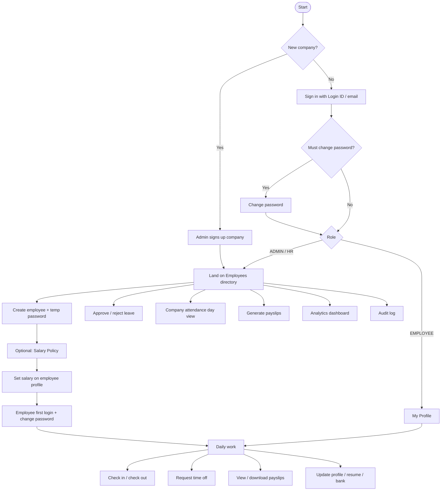

# Dayflow HRMS

**Every workday, perfectly aligned.**

Enterprise-style Human Resource Management System built for the **Odoo × NMIT Bangalore Hackathon 2026**.

Repository: [github.com/Vignesh-Salian/odoo-dayflow-hackathon-2026](https://github.com/Vignesh-Salian/odoo-dayflow-hackathon-2026.git)

---

## What is Dayflow?

Dayflow is a full-stack HRMS that helps a company manage people, presence, leave, and pay in one place:

| Area | What it does |
|------|----------------|
| **Company & auth** | Sign up a company, JWT login, force password change for new hires |
| **Employees** | Directory, profiles, org chart, manager assignment, resume/skills/bank |
| **Attendance** | Check-in / check-out, monthly calendar, company day view, regularizations |
| **Time off** | Leave balances, requests, manager approvals |
| **Payroll** | Company salary policy, per-employee wage structures, payslip PDFs |
| **Analytics** | Attendance / workforce summaries for Admin & HR |
| **Governance** | Notifications, company settings, admin audit log |

Roles: **ADMIN**, **HR**, **EMPLOYEE** — each sees a tailored home and nav.

---

## Stack

| Layer | Tech |
|-------|------|
| Frontend | React 19, Vite 8, TypeScript, Tailwind CSS v4, TanStack Query, React Router 7, Lucide, Recharts, Socket.io client |
| Backend | Express 5, TypeScript, Zod, Prisma 6, JWT, Socket.io, PDFKit |
| Database | PostgreSQL (Neon cloud or local / Docker) |

```
Browser (Vite :5173)
    │  REST /api/v1  +  Socket.io  +  /uploads
    ▼
Express API (:3000)
    ▼
Prisma → PostgreSQL
```

Detailed setup:

- [frontend/README.md](frontend/README.md) — UI routes, theme, env
- [backend/README.md](backend/README.md) — modules, API, Prisma, seed, tests

---

## User flow

High-level journey from company creation through daily HR operations:



### Role cheat sheet

| Actor | Typical path |
|-------|----------------|
| **Admin** | Signup → Employees → Salary Policy → set wages → generate payslips → analytics / audit |
| **HR** | Employees directory → attendance day view → leave approvals → generate payslips |
| **Employee** | Login → change password if required → check in → time off → payroll PDFs → my profile |

For a step-by-step demo script, see [DEMO_WALKTHROUGH.md](DEMO_WALKTHROUGH.md).

---

## Quick start

### Prerequisites

- Node.js 18+
- PostgreSQL 15+ (Neon, local, or Docker)

### 1. Backend

```bash
cd backend
cp .env.example .env   # set DATABASE_URL, DIRECT_URL, JWT secrets
npm install
npx prisma generate
npx prisma db push     # or: npx prisma migrate dev
npm run seed
npm run dev            # http://localhost:3000
```

### 2. Frontend

```bash
cd frontend
cp .env.example .env   # VITE_API_BASE_URL=/api/v1 is fine with Vite proxy
npm install
npm run dev            # http://localhost:5173
```

Open **http://localhost:5173** → sign in with demo credentials or create a company at `/signup`.

### Weekend demos

Check-in is blocked on weekends. Override “today” with a weekday:

```ini
# backend/.env
DEMO_TODAY=2026-08-21

# frontend/.env  (must match)
VITE_DEMO_TODAY=2026-08-21
```

Leave both empty to use the real calendar date. Restart both servers after changing env.

---

## Demo credentials

After `npm run seed` in `backend/`:

**Password for all seeded users:** `Demo@2026`

| Role | Login ID | Email | Name |
|------|----------|-------|------|
| ADMIN | `OIADLO20220001` | `ada.admin@odoo-india.demo` | Ada Lovelace |
| HR | `OIHARA20230001` | `hari.hr@odoo-india.demo` | Hari Rao |
| EMPLOYEE | `OIJODO20220002` | `john.doe@odoo-india.demo` | John Doe |

Full list: [DEMO_CREDENTIALS.md](DEMO_CREDENTIALS.md).

---

## Main features (product)

- **Company signup** — bootstrap company + first ADMIN, optional logo  
- **Employee onboarding** — auto login ID, temp password, must-change-password gate  
- **Org chart & managers** — hierarchy on Employees dashboard; Admin/HR assign managers  
- **Live presence** — Socket.io presence + check-in widget  
- **Attendance** — personal month view; Admin/HR company day view + regularization  
- **Time off** — balances, request/approve, sync with attendance  
- **Company salary policy** — ADMIN configures component rules & statutory rates  
- **Salary structures** — wage → Basic / HRA / allowances → PF / PT → net  
- **Payslips** — generate by month; authenticated PDF download  
- **Light / dark theme** — app-wide theme toggle  

---

## Repository layout

```
odoo-dayflow-hackathon-2026/
├── backend/                 # Express API + Prisma (see backend/README.md)
├── frontend/                # React SPA (see frontend/README.md)
├── DEMO_CREDENTIALS.md
├── DEMO_WALKTHROUGH.md
├── Dayflow_HRMS_Build_Plan.md
├── TEAM_OWNERS.md
├── docker-compose.yml       # optional local Postgres
└── README.md                # this file
```

---

## Team

| Person | Member | Focus |
|--------|--------|--------|
| A | Prasanna | Auth, schema, middleware, seed, audit |
| B | Nidhish | Employees, payroll, payslips |
| C | Vignesh | Attendance, presence, analytics |
| D | Prajwal | Time off, notifications, shared UI |

See [TEAM_OWNERS.md](TEAM_OWNERS.md).

---

## License / hackathon

Built for **Odoo × NMIT Bangalore Hackathon 2026** (virtual round). Not a production SaaS distribution.
