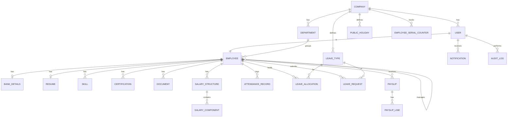

# Dayflow ER diagram (Phase 7 — Prajwal)

Source: Build Plan §4. Paste into README or slides for the demo.

## Demo talking points
- Money as `numeric`, never float
- Unique `(employee_id, date)` on attendance — no double check-in
- Salary components always sum to wage via `BALANCE`
- Attendance ledger drives payslip payable days
